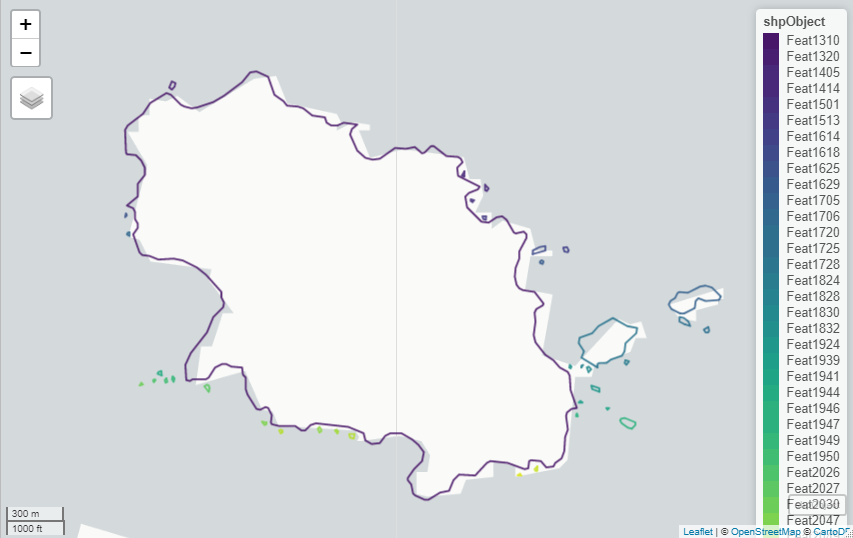

<!-- README.md is generated from README.Rmd. Please edit that file -->

Linear Feature Tools (rLFT)
===========================

<!-- badges: start -->
<!-- badges: end -->

The goal of rLFT is to assist users in extracting data from linear
features and shp files. This is accomplished with the help of the sf
package and by utilizing linear referencing. Linear referencing gives us
a way to collect data as points on a line rather than using (x,y)
coordinates. We can then use measurements along features to locate these
points. This method of collecting data has a wide variety of
applications and can be used in various ways. For more information on
linear referencing see [ArcGIS’s
definition](http://desktop.arcgis.com/en/arcmap/10.3/guide-books/linear-referencing/what-is-linear-referencing.htm#GUID-89860EE9-D566-4795-B877-04F36D883003)

Available Linear Feature Tools:
-------------------------------

-   **Boundary Convexity Tool:** This tool calculates the relative
    degree of convexity or concavity at locations along line segments
    (specifically, “routes”) as well as the sinuosity of the line
    segment. The original need for creating the BCT was to characterize
    the degree of convexity (or concavity) at specific locations along a
    coastline in order to assess the potential for use of these areas by
    coastal river otters. It is suspected that these otters use convex
    sites (points that jut out into the water) as preferred latrine
    sites because the wind can more easily carry their scent. Many
    landscapes have linear boundaries whose shape may be important to
    animal movement and/or use. To calculate boundary convexity, we need
    to recognize that the value is ‘scale-dependent’. For example, a
    portion of coastline inside a bay may appear convex in shape
    (jutting into the ocean) from the perspective of 25 meters on either
    side of a given point, but concave at a broader view of 500 meters
    on either side. As such, this tool was developed to quantify
    convexity at a series of points along a route, with a user-defined
    window-size (distance to consider either direction from the point of
    measurement). This is essentially a “moving window” analysis for
    line features.

Installation
------------

You can install the released version of rLFT from
[CRAN](https://CRAN.R-project.org) with:

``` r
install.packages("rLFT")
```

Example
-------

This is a basic example:

``` r
library(rLFT)
## Loading in data from shp file. If you want to use your own shp file
## use the sf library function st_read("directory of desired shp file").
## For more information on the sf package see: https://cran.r-project.org/web/packages/sf/index.html
# data("shpObject")
outputTable <- bct(shpObject, 50, 100)
#>    user  system elapsed 
#>    0.04    0.00    0.05
```

View the resulting data from “bct()” of the first 10 rows:

``` r
head(outputTable, 10)
#>    RID StepSize WindowSize RawConvexity ConvexityIndex Sinuosity
#> 1    1        0        100       28.549          0.571     0.635
#> 2    1       50        100      -18.641         -0.373     0.578
#> 3    1      100        100      -19.891         -0.398     0.625
#> 4    1      150        100       24.944          0.499     0.623
#> 5    1      200        100        2.458          0.049     0.501
#> 6    1      250        100        9.879          0.198     0.512
#> 7    1      300        100       -4.640         -0.093     0.513
#> 8    1      350        100       -6.607         -0.132     0.553
#> 9    1      400        100      -19.972         -0.399     0.600
#> 10   1      450        100       -1.041         -0.021     0.517
#>    Midpoint X Midpoint Y
#> 1    354048.5    1226757
#> 2    354045.2    1226806
#> 3    354010.6    1226834
#> 4    353967.2    1226824
#> 5    353935.4    1226862
#> 6    353907.5    1226904
#> 7    353898.0    1226953
#> 8    353879.9    1226997
#> 9    353853.1    1227031
#> 10   353803.7    1227031
```

If you want to view the entire table use:

``` r
View(outputTable)
```

Here is a map view of the sf Object that was used to get the above data
(accessed using the mapview library):


